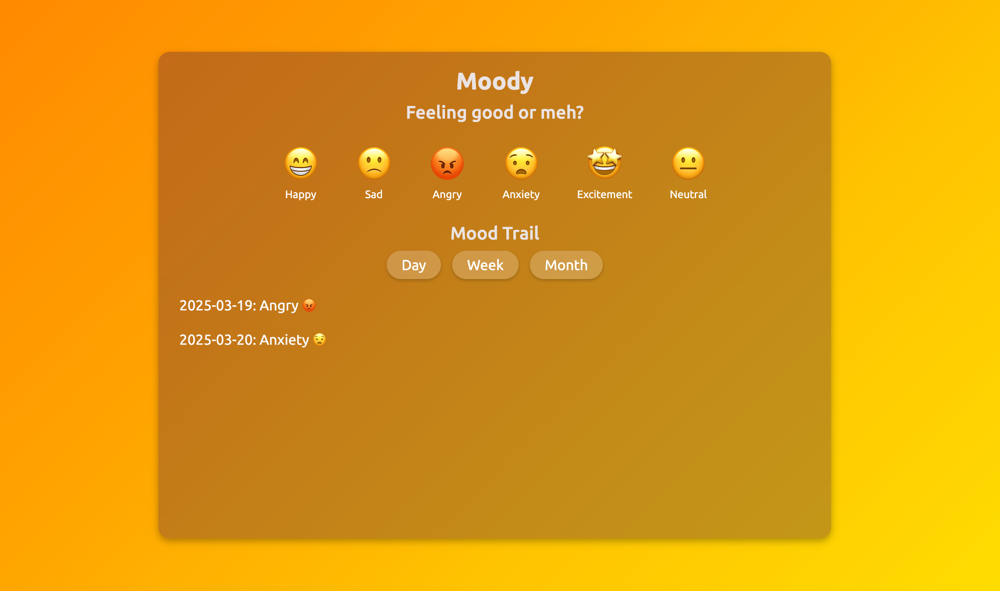

# Moody

## Overview

Moody is a web application which enables the user to track their mood on a daily basis. User can select their mood from the available options and track it on the basis of Day/Week/Month.container

## Features

+ User can log their daily mood through emoji-based buttons
+ Restricts user to log a single entry per day 
+ Track the mood history on the basis of Day, Week or Month
+ The logged moods are stored in localStorage
+ Simple UI with responsive design

## Technologies
- HTML
- CSS
- JavaScript

### Screenshot

### Deployment Link

[Deployment Link](https://mood-tracker-steel.vercel.app/)

